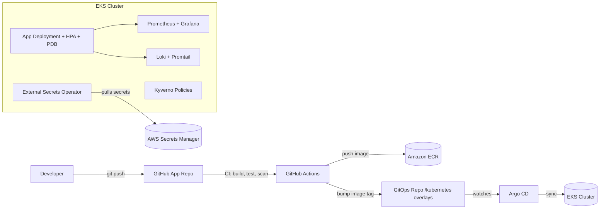

# Production-Grade Kubernetes Platform on AWS EKS

A full-scale, senior-level DevOps reference project modeling how a real platform team ships and operates a
microservice on Kubernetes: **Terraform → EKS → GitOps (Argo CD) → CI/CD → Observability → Security**, across
three environments (dev / staging / prod).

This is not a toy "deploy nginx" demo. It reflects decisions you'd actually defend in a senior DevOps/Platform
Engineer interview or design review: why GitOps over `kubectl apply`, why Kustomize over raw Helm values sprawl,
how promotion between environments works, how secrets are handled without ever touching git, and how the
platform is observed and secured.

## Architecture



**Core principle: Git is the single source of truth.** Nothing is ever applied to the cluster by hand. CI builds
and pushes an image; it never touches the cluster. Argo CD is the only thing with cluster-apply permissions,
and it only acts on what's committed to the `kubernetes/` GitOps path. This separation (CI ≠ CD) is the single
biggest thing that distinguishes a senior setup from a junior one.

## Repository layout

```
terraform/            # AWS infra: VPC, EKS, IAM (IRSA), RDS - per environment, DRY via modules
app/                   # Sample Go/Node microservice: /healthz, /readyz, /metrics
kubernetes/
  base/                # Kustomize base manifests (env-agnostic)
  overlays/{dev,staging,prod}/  # Per-env patches: replicas, resources, domain, secrets refs
gitops/argocd/         # App-of-Apps pattern - one Argo Application per env, self-managing
.github/workflows/     # CI (build/test/scan) and CD (GitOps bump) pipelines
observability/         # Prometheus rules, Grafana dashboards, Loki, alerting
security/              # Kyverno policies, RBAC, NetworkPolicies, External Secrets
scripts/               # bootstrap.sh / teardown.sh to stand up the whole stack
docs/                  # Runbooks, disaster recovery, on-call playbook
```

## Design decisions (the "why" a senior engineer is expected to explain)

| Decision | Rationale |
|---|---|
| **Argo CD (pull-based GitOps)** instead of CI running `kubectl apply` (push-based) | No cluster credentials ever leave the cluster; CI only needs registry + git write access. Drift is auto-corrected and visible in the UI/diff. |
| **Kustomize overlays** instead of one Helm chart with giant `values-{env}.yaml` | Base manifests stay declarative and readable; per-env deltas are explicit patches, easy to diff in review. Helm is still used for third-party charts (Prometheus, Argo CD itself, Kyverno). |
| **IRSA (IAM Roles for Service Accounts)** instead of node-wide IAM roles or static keys | Least privilege per pod; the app's ServiceAccount can only reach the exact Secrets Manager path / S3 bucket it needs. |
| **External Secrets Operator** instead of secrets committed (even sealed) to git | Secrets never enter git history at all, sealed or not; rotation in AWS Secrets Manager propagates automatically. |
| **Kyverno admission policies** instead of trusting PR review alone | `disallow-latest-tag`, `require-resource-limits`, `require-probes`, `disallow-privileged` are enforced at admission, not hoped for in code review. |
| **PodDisruptionBudget + topology spread + HPA** on every workload | Cluster upgrades, node scaling, and AZ failure are routine events in prod, not edge cases. |
| **Three real environments with promotion**, not one cluster with three namespaces | Mirrors how prod actually gets protected: staging validates the exact image before it's promoted by bumping a tag in `overlays/prod`. |
| **Trivy scanning + SBOM in CI**, blocking on CRITICAL CVEs | Supply-chain security is a day-one requirement in any real org, not an afterthought. |

## Getting started

```bash
# 1. Provision AWS infra (VPC + EKS + IRSA roles) for dev
cd terraform/environments/dev && terraform init && terraform apply

# 2. Bootstrap the cluster: Argo CD, Prometheus stack, Kyverno, External Secrets
../../../scripts/bootstrap.sh dev

# 3. Point Argo CD at the app-of-apps root
kubectl apply -f gitops/argocd/applications/app-of-apps.yaml

# Argo CD will now reconcile kubernetes/overlays/dev onto the cluster and keep it in sync.
```

See `docs/runbooks/` for on-call procedures and `docs/disaster-recovery.md` for the restore process.

## What to highlight in an interview

1. Walk through the **GitOps promotion flow**: a merged PR to `main` → CI builds/scans/pushes an image tagged
   with the git SHA → a second job bumps that SHA into `kubernetes/overlays/dev/kustomization.yaml` → Argo CD
   auto-syncs dev → after manual approval (Argo CD `sync-wave` / PR to `overlays/prod`), the same image is
   promoted to prod. **The image built once is the exact image that reaches prod** — no rebuilding per env.
2. Explain how a **secret gets from AWS Secrets Manager into a pod** without ever being in git: External
   Secrets Operator + IRSA + `ExternalSecret` CR → syncs into a native `Secret` → mounted as env var.
3. Explain **what happens when a node dies mid-deploy**: PDB prevents voluntary disruption below minAvailable,
   HPA + Cluster Autoscaler reschedule pods, readiness probes gate traffic until the new pod is actually ready.
4. Explain the **CI ≠ CD boundary** and why giving CI cluster credentials is an anti-pattern.
